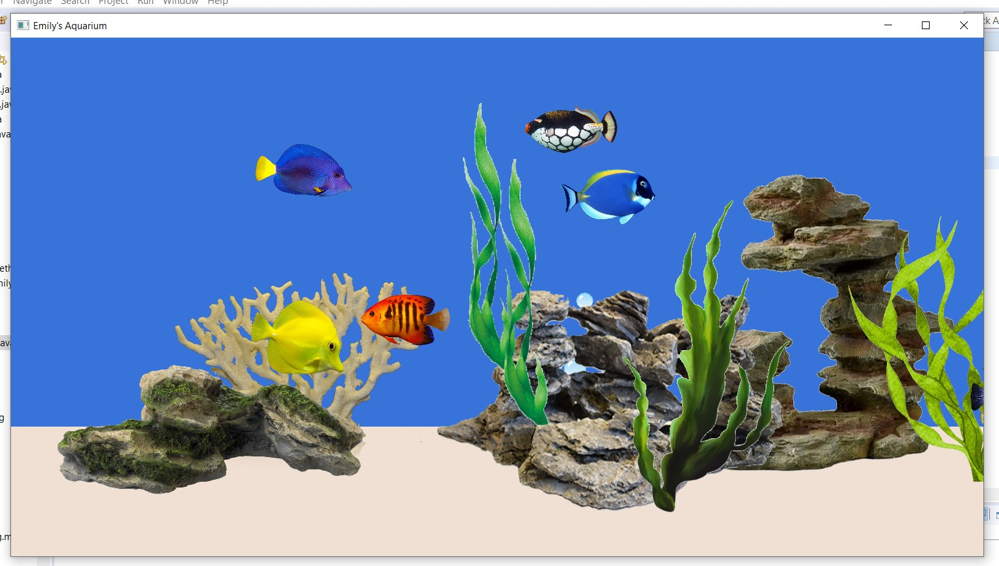

# Fish Aquarium Display

### A relaxing fish aquarium display developed in Java using JavaFX. It plays the "NEMO" theme song in the background as fish swim by and other components like corals and bubbles move in the background.

